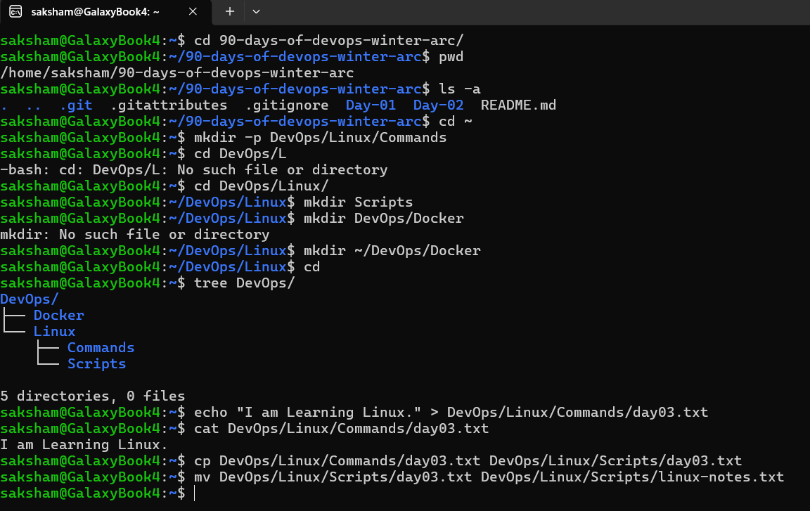
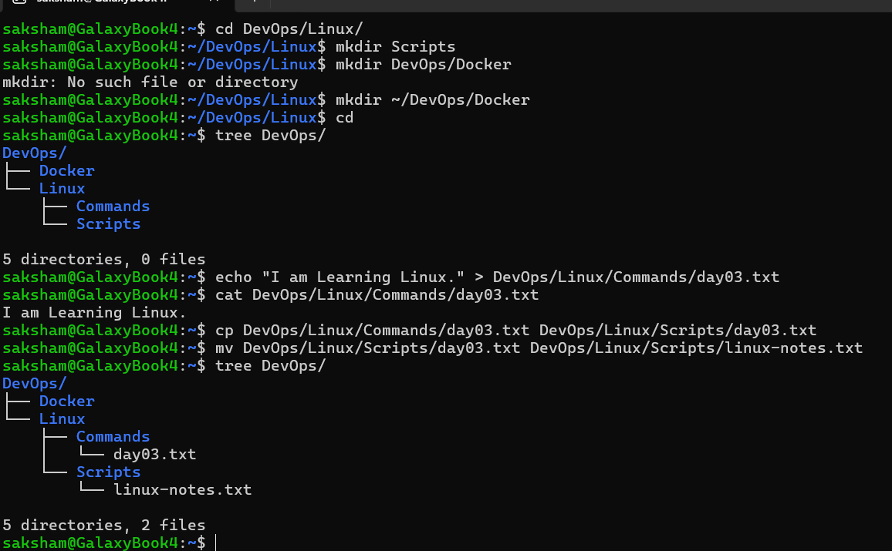
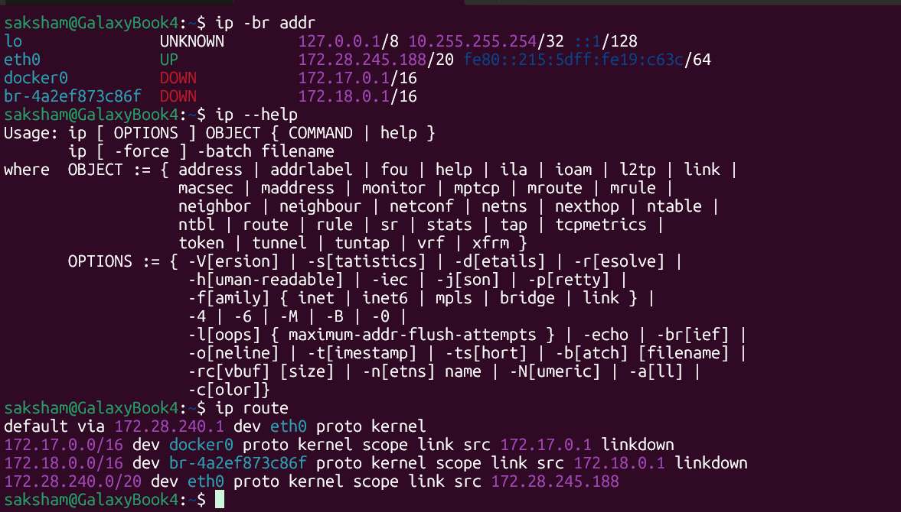
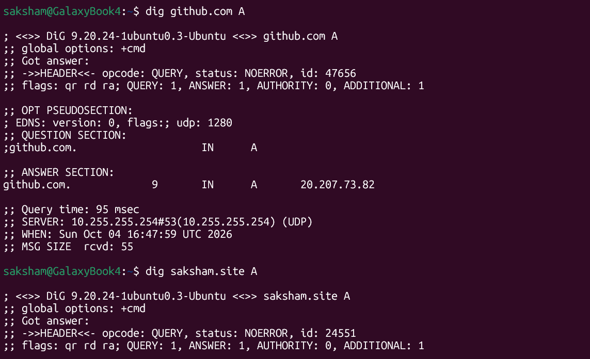
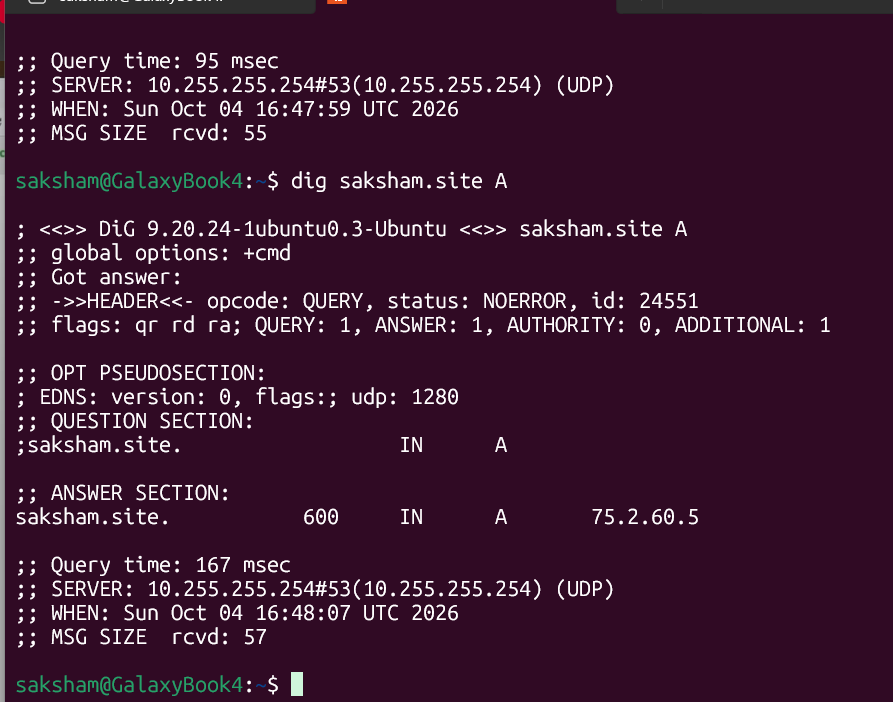
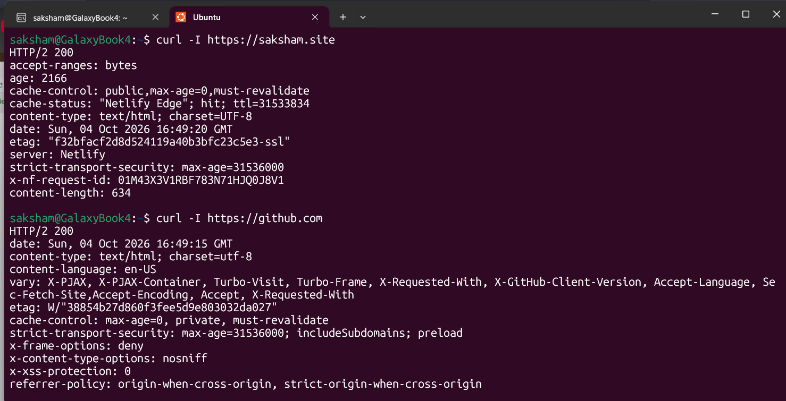
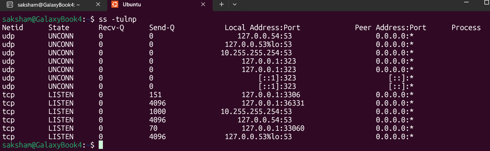

# Day 3 — Networking Fundamentals

## Objective

Understand the networking basics needed to diagnose connectivity between applications, servers, and services, then inspect them in Ubuntu WSL.

**Date:** October 4, 2026  
**Status:** Completed

## Why networking matters in DevOps

Applications depend on DNS to find services, routes to reach them, and ports to connect to the right application. Checking these layers helps narrow down failures during deployments and troubleshooting.

## Topics Covered

- IPv4 and IPv6; public and private addresses
- Network and host parts of an IPv4 address
- Subnet masks and CIDR prefixes
- Interfaces, loopback, local routes, and the default gateway
- DNS A records, TTL, and the resolver
- TCP and UDP; listening ports and socket states
- HTTP status codes and response headers

## Concept Notes

### IP address, network part, and host part

An IP address identifies an interface. IPv4 uses 32 bits, usually displayed as four numbers such as `192.168.1.10`. IPv6 uses 128 bits.

The prefix identifies the network; the remaining bits identify addresses within it. Devices compare the destination with their own subnet to decide whether it is local or needs a router.

### Subnet mask and CIDR

A subnet mask marks the network bits with 1s and the host bits with 0s. CIDR expresses the number of network bits after a slash.

For `192.168.1.10/24`:
- Prefix: 24 network bits, leaving 8 host bits.
- Equivalent subnet mask: `255.255.255.0`.
- Network address: `192.168.1.0`.
- Address range: `192.168.1.0–192.168.1.255`.
- Total addresses: `2^(32 - 24) = 256`.
- In a conventional IPv4 /24 subnet, 254 addresses are usable by hosts because the network and broadcast addresses are reserved. This rule has exceptions, including /31 and /32.

CIDR defines the network/host split; it also lets me calculate the subnet size.

My WSL address was `172.28.245.188/20`:
- Mask: `255.255.240.0`.
- Network: `172.28.240.0/20`.
- Range: `172.28.240.0–172.28.255.255`.
- Total addresses: 4,096; conventional usable host addresses: 4,094.
- Default gateway observed: `172.28.240.1`.

### Public, private, and loopback

Public addresses are used for Internet routing. Private IPv4 ranges are `10.0.0.0/8`, `172.16.0.0/12`, and `192.168.0.0/16`; Internet access commonly uses NAT. Loopback addresses such as `127.0.0.1` and `::1` refer to the local machine.

### DNS

DNS maps names to records. An A record returns an IPv4 address. The TTL says how long an answer may be cached; the resolver is the server that answers my query. `NOERROR` means the DNS query completed without a DNS error; the answer section tells me what was returned.

### TCP LISTEN and UDP UNCONN

- **LISTEN:** a TCP socket is waiting for incoming connection requests. It does not mean a client is already connected.
- **UNCONN:** a UDP socket has no fixed peer. UDP is connectionless, so this is normal for many UDP services and does not mean the socket is broken.
- An address such as `127.0.0.1:3306` is bound to loopback in this Linux environment.
- `0.0.0.0:*` in the peer column represents no specific remote peer; it does not show which local interfaces the service uses.

### HTTP

`curl -I` requests response headers using HEAD. `HTTP/2 200` shows that these HEAD requests succeeded using HTTP/2. Headers provide information such as content type, caching, and the server. This observation does not prove every page or application function works.

## Hands-on Labs and Results

### 1. Inspect interfaces and routes

```bash
ip -br addr
ip --help
ip route
```

Observed:
- `eth0` was UP with IPv4 `172.28.245.188/20`.
- The directly connected network was `172.28.240.0/20`.
- The default route used `172.28.240.1` through `eth0`.
- `lo` showed loopback addresses; its UNKNOWN state does not itself indicate a failure.
- Docker bridge interfaces had `172.17.0.1/16` and `172.18.0.1/16`; both were DOWN at the time.

### 2. Query DNS records

```bash
dig github.com A
dig saksham.site A
```

Observed:
- `github.com`: A record `20.207.73.82`, TTL 9 seconds.
- `saksham.site`: A record `75.2.60.5`, TTL 600 seconds.
- Both queries returned `NOERROR`.
- Resolver: `10.255.255.254` on port 53, using UDP.

These were answers at the time of the lab; DNS answers and TTLs can change.

### 3. Inspect HTTP response headers

```bash
curl -I https://saksham.site
curl -I https://github.com
```

Both returned `HTTP/2 200` during the lab. The saksham.site response included Netlify server and cache headers; both responses included content type and security-related headers.

### 4. Inspect local sockets

```bash
ss -tulnp
```

Options: `-t` TCP, `-u` UDP, `-l` listening/unconnected sockets, `-n` numeric addresses and ports, `-p` process information where permission allows.

Observed TCP LISTEN entries included ports 53, 3306, 33060, and 36331. UDP UNCONN entries included ports 53 and 323. The process column was blank in the screenshot, so I did not identify the owning applications from this output alone.

## Linux Revision Assignment

Completed the provided Day 3 Linux revision assignment, separately from the networking labs.

Commands practised:
`cd`, `pwd`, `ls -a`, `mkdir -p`, `mkdir`, `echo`, `>`, `cat`, `cp`, `mv`, and `tree`.

Work completed:
1. Navigated into the challenge repository and inspected its contents.
2. Created `~/DevOps/Linux/Commands`, `~/DevOps/Linux/Scripts`, and `~/DevOps/Docker`.
3. Wrote `I am Learning Linux.` into `Commands/day03.txt` and displayed it with `cat`.
4. Copied the file into `Scripts`, then renamed it to `linux-notes.txt`.
5. Verified the final layout with `tree`: five directories and two files.

```text
DevOps/
├── Docker/
└── Linux/
    ├── Commands/
    │   └── day03.txt
    └── Scripts/
        └── linux-notes.txt
```

## Troubleshooting and Key Learnings

- A shortened path, `DevOps/L`, failed because that directory did not exist; using `DevOps/Linux/` worked.
- From inside `~/DevOps/Linux`, `mkdir DevOps/Docker` looked for nested parents beneath the current directory. Using `mkdir ~/DevOps/Docker` created the intended directory.
- Relative paths depend on the current directory; `~` starts from my home directory.
- CIDR and subnet masks describe the same prefix in different formats.
- Routing, DNS resolution, HTTP responses, and local socket states answer different troubleshooting questions.
- UDP UNCONN is a normal state, while TCP LISTEN means a server is waiting for connections.
- Screenshots record the observed environment and results.

## Learning Resources

- [Abhishek Veeramalla — Learn Networking in 3 Hours | Networking Fundamentals + AWS VPC Networking](https://www.youtube.com/watch?v=iSOfkw_YyOU)
- [GeeksforGeeks — What is an IP address?](https://www.geeksforgeeks.org/computer-science-fundamentals/what-is-an-ip-address/)

## Links

- [Day 3 GitHub documentation](https://github.com/Raisaksham4/90-days-of-devops-winter-arc/tree/main/Day-03)
- [Repository](https://github.com/Raisaksham4/90-days-of-devops-winter-arc)
- LinkedIn: Day 3 post scheduled for October 4, 2026 at 11:00 pm IST, with seven screenshots.

## Screenshots

### Linux revision: commands and corrected paths



### Linux revision: verified final directory structure



### WSL interfaces, IP addresses, CIDR prefixes, and routes



### DNS A-record lookup for GitHub



### DNS A-record answer for saksham.site



### HTTP response headers from both websites



### Local TCP listeners and UDP sockets


