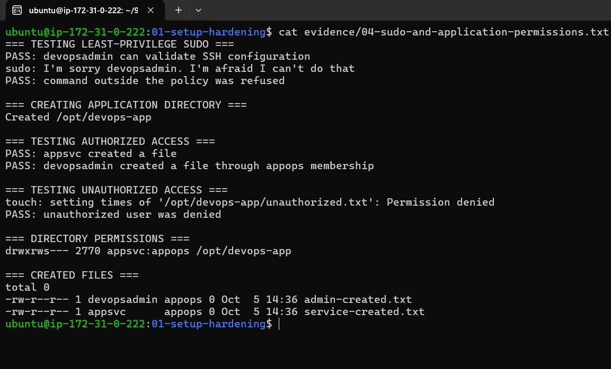
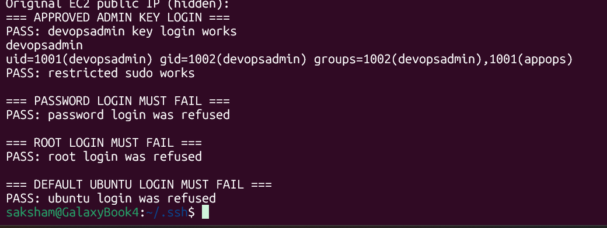
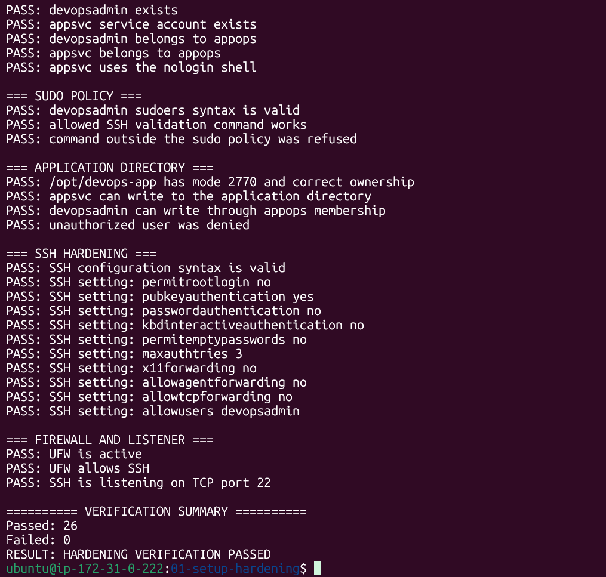

# ❄️ Day 4/90 — Linux Processes, Permissions and Server Hardening

**Date:** October 5, 2026
**Status:** Completed

## What I worked on

Today I applied Linux user, group and permission concepts in a practical [Week 1 server hardening lab](../Week-Tasks/Week-1/01-setup-hardening/). I worked on an Ubuntu 26.04 LTS EC2 instance and used service and process commands to check SSH and the firewall.

## Hands-on work

- Created `devopsadmin`, a named administrator, and `appsvc`, a non-interactive service account.
- Put both accounts in the `appops` group.
- Wrote a restricted sudo policy for SSH maintenance and verified an unrelated root command was denied.
- Set `/opt/devops-app` to `2770 appsvc:appops`; tested authorized and unauthorized writes.
- Set up SSH key authentication, disabled password and root login, and allowed only `devopsadmin` to start new SSH sessions.
- Enabled UFW with incoming traffic denied by default and OpenSSH explicitly allowed.
- Checked SSH and UFW service state, SSH's TCP port 22 listener, and the effective SSH configuration.
- Built a reusable verification script. Its final run reported **26 passed, 0 failed**.

## Commands and concepts

| Command | What I used it for |
|---|---|
| `id`, `getent` | Check users and group membership |
| `stat`, `ls -l` | Inspect ownership and file modes |
| `sudo -l`, `visudo -cf` | Inspect and validate the restricted sudo policy |
| `sshd -t`, `sshd -T` | Validate SSH syntax and inspect effective settings |
| `systemctl` | Check and restart services |
| `ss -ltn` | Confirm SSH listens on TCP port 22 |
| `ufw status verbose` | Inspect the active firewall |

`2770` means the owner and group can access the directory, others have no access, and new files inherit the directory's group. The `appsvc` account uses `/usr/sbin/nologin`, so it can run a service without an interactive shell.

## Issue and fix

I applied `AllowUsers devopsadmin` before finishing all work that needed the original `ubuntu` administrator account, then closed that session. New `ubuntu` SSH logins were correctly refused, so I recovered access by taking an EBS snapshot, attaching the root volume to a temporary rescue instance, temporarily permitting `ubuntu`, then restoring the intended SSH policy after the remaining work was done.

**Lesson:** Keep an existing admin session open while changing SSH, verify a fresh second login, and finish root-level setup before removing the original admin path.

## Result

- `devopsadmin` key login and restricted sudo: **passed**
- Password, root, and default `ubuntu` SSH logins: **refused**
- Unauthorized application-directory write: **refused**
- SSH through active UFW: **passed**
- Automated verification: **26 passed, 0 failed**

## Evidence

The [Week 1 task](../Week-Tasks/Week-1/01-setup-hardening/) contains the reusable SSH and sudo configuration, scripts, detailed notes, and text evidence.
